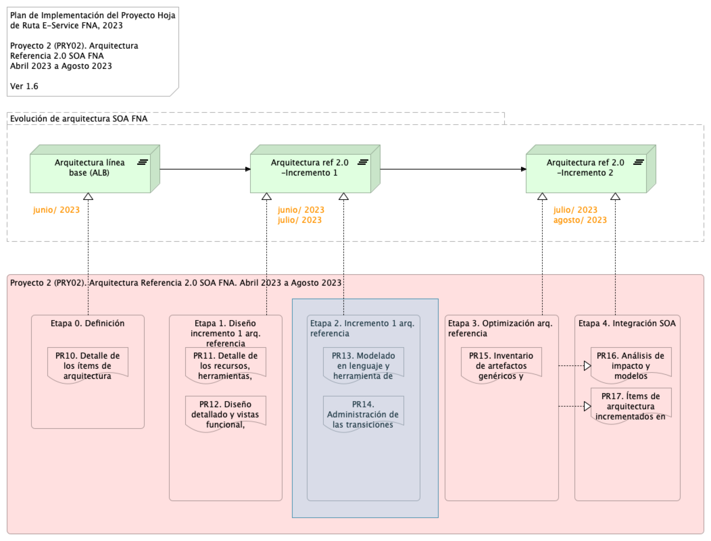

\newpage

>    E-Service. Fase II
>
>    $PROYECTO. $PROY_DESCR. Contenido de los Productos Contractuales
>
>    Contrato 1812020
>
>    FNA, Stefanini
>
>    $FECHA_COMPILACION
>
>    **Versión** 1.$COMMIT

 

# Producto 13: PR13. $PR13_NOMBRE
El principal entregable de este producto son los modelos de arquitevtura de referencia 2.0 del FNA. Para la mayoría de los casos, y en este contexto, los modelos refieren a conjuntos información de ingeniería (no se agotan en solo diagramas o documentos) relevante a los sistemas de información, servicios, componentes y herramientas de software del FNA representados con el lenguaje de descripción de arquitectura designado, que para el caso es Archimatye 3.0. Nota: distintos modelos de igual importancia que la arquitectura del FNA pueden estar representados en otros lenguajes de componentes, procesos de negocio, rendimiento, redes de comunicaciones.

Otro entregable primario de este producto es la documentación técnica inicial con la que denotamos a las espeficaciones de línea base de la arquitectura de referencia 2.0 del FNA. Siendo que esta información textual puede ser considerada como discreta y de que no puede ser verificada (distinta de los modelos), sigue teniendo la ventaja de que es fácil de comunicar.

Juntos, los modelos y las especificaciones y requerimientos de arquitectura, estos entregables constituyen lo que llamamos la Arquitectura de Referencia SOA 2.0 del FNA, y que además de ser una línea base, tiene la responsabilidad adicional de ser la hoja de ruta y, por tanto, guía de la transformación de las arquitectura estado actual hacia esta nueva versión.

**Nota**: los análisis de este producto están dirigidos a cumplir los objetivos del proyecto PRY01, Gobierno SOA: desarrollo, gestión, gobierno de arquitectura y adopción.

 

## Justificación
La representación de la información de ingeniería relevante a los sistemas de información, servicios, componentes y herramientas de software del FNA en elementos de un modelo de arquitecturas supone algunas ventajas frente a la información textual, y de cualquier otro tipo, y de ahí el mérito de estos. Una de estas ventajas es que los modelos pueden acopiar y _asociarse (mapear) con requerimientos de arquitectura mediante unidades de trabajo accionables como épicas, casos de uso, historias y escenarios_. Además, los modelos comportan la ventaja de que son verificables y de fácil transporte. Pero ninguna de estas razones es lo más importante. La verdadera justificación de tener modelado de esta arquitectura de referencia 2.0 (en un lenguaje de descripción de arquitectura) es que el FNA cuente con la creación de un entorno centrado en modelos, el cual, deja abierta la posiblida de la aplicación de técnicas y creación de productos de ingeniería.

## Contenidos
1. Análisis de los elementos del modelo de la arquitectura de referencia SOA 2.0 del FNA
1. Repositorio de arquitectura del FNA actualizado con arquitectura de referencia
1. Documentación técnica 0.2 de la arquitectura de referencia SOA
1. Proceso de mantenimiento de la arquitectura de referencia SOA 2.0 del FNA

 

## Criterios de Aceptación
* Repositorio de arquitectura del FNA actualizado con arquitectura de referencia
* Entendimiento del proceso de mantenimiento de la arquitectura de referencia SOA 2.0 del FNA y sus implicaciones

 

## Repositorio de Arquitectura del FNA, versión 0.1
{#fig: width=}

_Fuente: Diagnóstico SOA. E-Service (2022)._

## Modelo de Implementación del $PROYECTO
{#fig: width=}

_Fuente: Elaboración propia._

 
