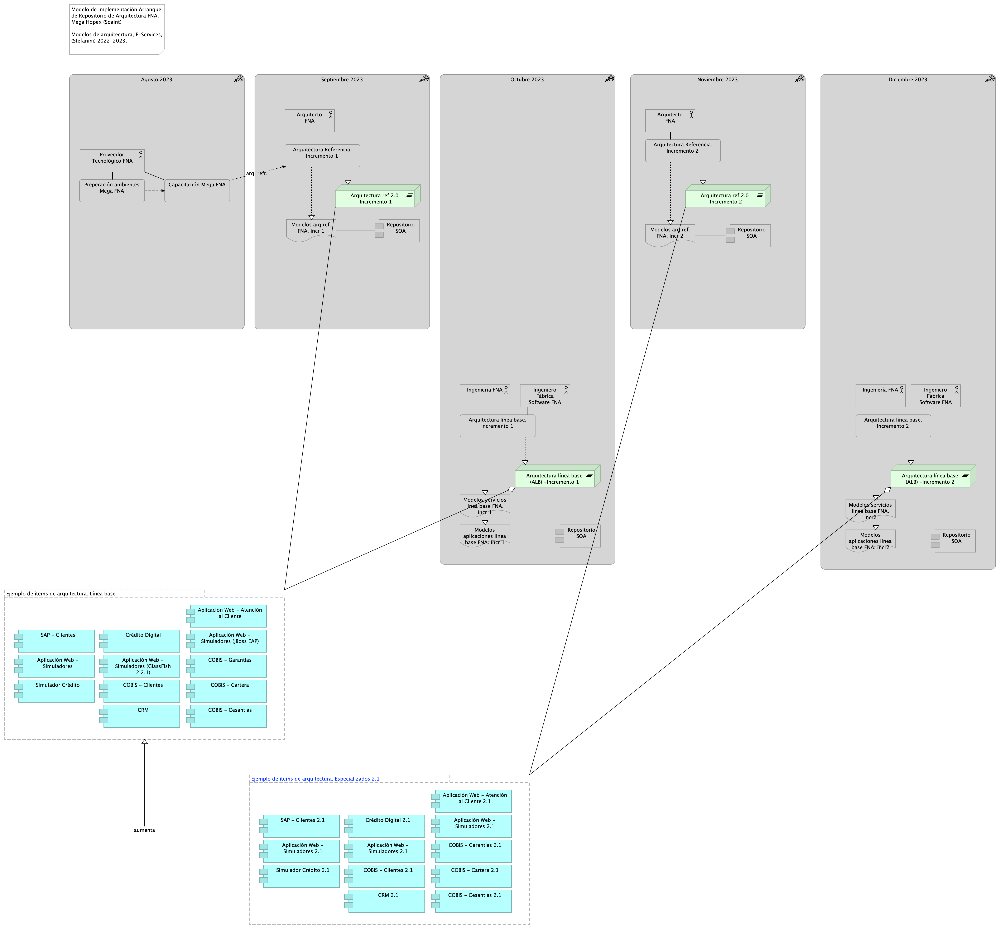

---
prnombre: "Modelado en lenguaje y herramienta de diseño del FNA​"
...

\newpage

| Tema           | $PR13_NOMBRE: **Estrategia de poblamiento del repositorio de arquitectura del FNA** |
|----------------|----------------------------------------------------------------------|
| Palabras clave | SOA, Arquitectura de referencia, Modelos, Estrategia de poblamiento, Migración |
| Autor          |                                                              |
| Fuente         |                                                              |
| Versión        | **1.$COMMIT** del $FECHA_COMPILACION                       |
| Vínculos       | [Ejecución Plan de Trabajo SOA](onenote:#N001d.sharepoint.com); [Procesos de Negocio FNA](onenote:#N003a.com)|

 

# Estrategia de Poblamiento del Repositorio de Arquitectura del FNA
Es importante plantear una forma de organizar el trabajo que tiene por objeto el portar a la herramienta Hopex Mega, versión 4.5 del FNA, los modelos FNA producidos y actualizados en este proyecto, pero que vienen modificándose desde el anterior proyecto de esta consultoría, y que están desarrollados con lenguaje ArchiMate 3.0, representado en formato de intercambio de modelos, XMI compatible.

## 1. Migración de Arquitectura de Referencia del FNA (LIN01)
La estrategia de migración de los modelos que planteamos es dividir el trabajo en dos líneas de migración: modelos de línea base (LIN01. Arquitectura Referencia. Incremento 1 en el diagrama del modelo de implementación), y modelos de arquitectura de referencia (LIN02. Arquitectura línea base. Incremento 1). 

{#fig:5b.Repositorioarq.png width=}

_Fuente: Diagnóstico SOA. E-Service (2022)._

Es de notar que es posible es iniciar con la línea 01, la de arquitectura de referencia, que por su temática particular trata de modelos nuevos, sin interdependencias con la realidad del FNA. Esto los hace más prácticos para este trabajo.

## 2. Migración de Línea Base de Modelos de Arquitectura FNA (LIN02)
La segunda línea de migración presenta mayores complicaciones que la anterior. Se trata de modelos de línea base (LIN02 Arquitectura línea base, en el diagrama del modelo de implementación abajo) que ya describen una realidad existente en el FNA. Por tanto, requiere de tanto más de validación como de depuración.

{#fig:5a.Repositorioarq.png width=}

_Fuente: Diagnóstico SOA. E-Service (2022)._

En la programación estas líneas, LIN01 y 02, pueden ser ejecutadas en paralelo. La recomendación es iniciar con la línea 01, la de arquitectura de referencia, que por su temática particular trata de modelos nuevos, sin interdependencias con la realidad del FNA. Esto los hace más prácticos para este trabajo.

 
