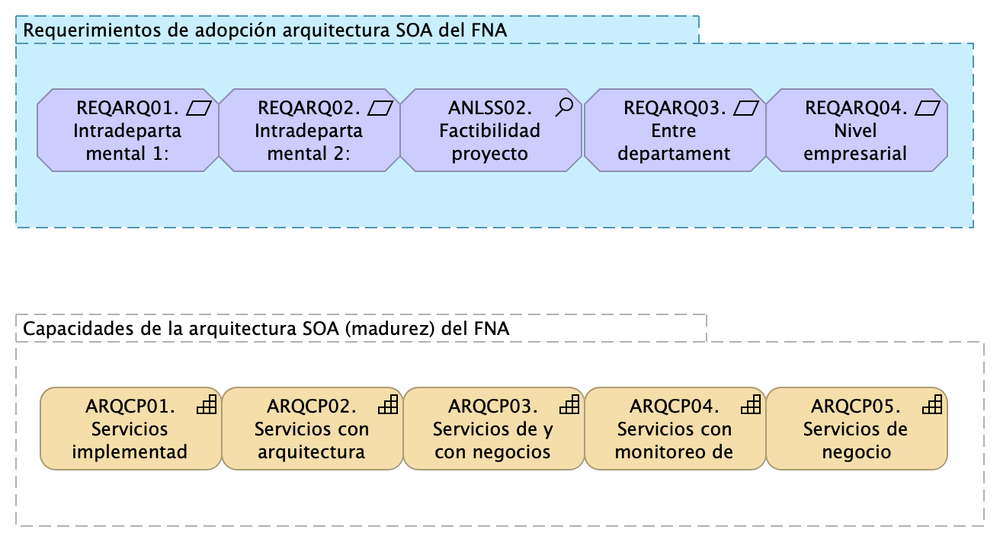
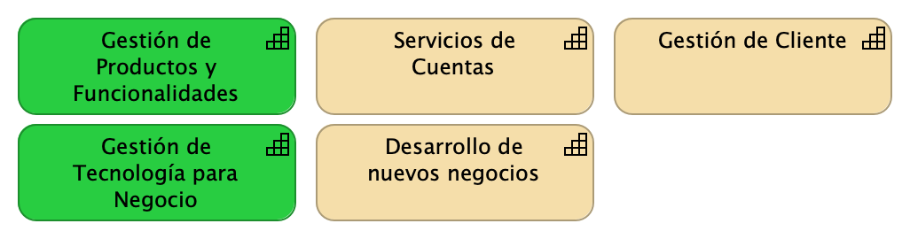
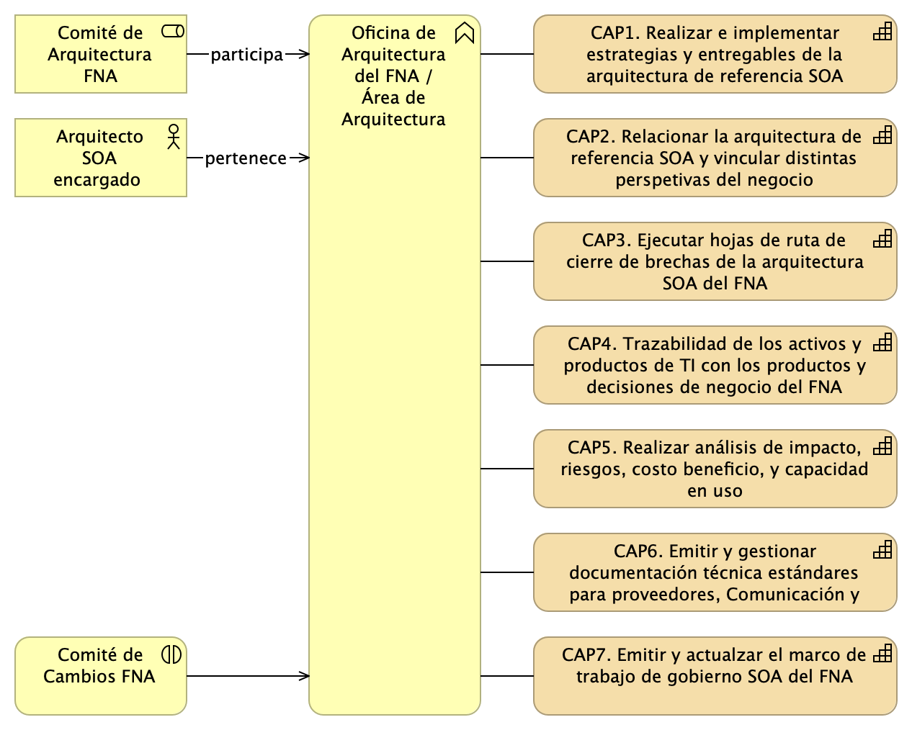
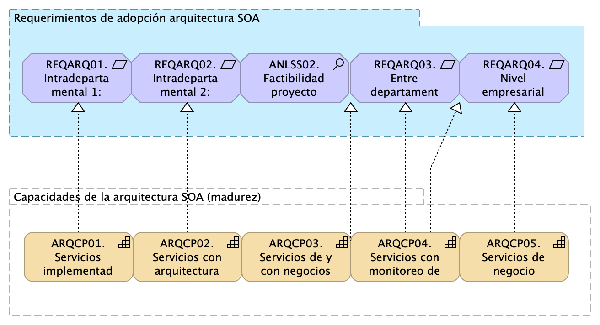

---
prnombre: "Administración de las transiciones hacia la arquitectura versión 2.0"
...

\newpage

| Tema           | $PR14_NOMBRE: **Posibles estadios de adopción y transición (madurez) de las arquitecturas para el FNA** |
|----------------|----------------------------------------------------------------------|
| Palabras clave | SOA, Arquitectura de referencia, Flujo de trabajo                    |
| Autor          |                                                              |
| Fuente         |                                                              |
| Versión        | **1.$COMMIT** del $FECHA_COMPILACION                       |
| Vínculos       | [Ejecución Plan de Trabajo SOA](onenote:#N001d.sharepoint.com); [Procesos de Negocio FNA](onenote:#N003a.com)|

 

# Estadios de Adopción y Transición de las arquitecturas para el FNA
La noción de adopción en el contexto de este proyecto es un instrumento para la adaptación de una nueva arquitectura dentro de un contexto de la empresa. El concepto de _adopción de nuevas arquitecturas_, visto también como instrumento de navegación, es importante porque informa sobre el horizonte de cambios contenidos en la hoja de ruta de las arquitecturas del FNA, determinada en este caso por la Oficina de Arquitectura de la empresa. Por otro lado, la adopción como proceso, provee información que sirve para tomar decisión a lo largo de dicha hoja de ruta, actividad claramente importante.

Antes de desarrollar los métodos de adopción, como proceso y como instrumento, debemos describir los estadios de expansión a los que le apuntamos, los cuales darán un orden y una percepción de progreso mientras la hoja de ruta de las arquitecturas se va desplegando.

Presentaremos a continuación un modelo de transición de capacidades de la arquitectura basado en niveles o estadios de expansión de las arquitecturas en el que involucraremos las capacidades de arquitectura y cómo estas van o apareciendo o fortaleciéndose en el tiempo.

Estadios de adopción SOA en el FNA

1. Intradepartamental y Servicios, Aplicaciones
1. Unidades de Negocio y Productos de Negocio
1. Entre Unidades de Negocio y Productos de Negocio
1. Empresarial y Proveedores de Servicios SOA

 

{#fig:adopcion1a.png width=}

A lo largo de esta secuencia de adopción de cambios establecida arriba, a la que llamamos estadios de adopción SOA del FNA, las capacidades del FNA involucradas y afectadas son las que indicamos en el siguiente apartado.

## Capacidades de la Empresa FNA
Esta vista preliminar de capacidades consignadas en el repositorio de arquitectura del FNA por la Fase I de E-Service, llamada la línea base de arquitectura, producto PR12, $PR12_NOMBRE, nos servirá posteriormente para relacionar dichas capacidades con lo niveles de adopción SOA propuesto arriba.

Capacidades de negocio encontradas:

1. Desarrollo de nuevos negocios
1. Gestión de Cliente
1. Administración de Recursos y Negocio
1. Entrega de Productos
1. Servicios de Cuentas
1. Gestión Financiera
1. Gestión de productos y funcionalidades (ERP)
1. Gestión de tecnología para negocios

_Fuente: Repositorio de arquitectura, línea base del FNA. PR12 de E-Service Fase II._

**Nota**: esta lista de capacidades no es exhaustiva. Es tan solo una parte de las capacidades que son foco de la actual consultoría.

 

{#fig:capacidades-neg.png width=}

_Fuente: Repositorio de arquitectura, línea base del FNA. PR12 de E-Service Fase II._

 

## Capacidades de Arquitectura del FNA
De la mano del proceso de gobierno SOA del FNA, @eservices3-22, presentamos estas capacidades que son equiparables con la arquitectura SOA del Fondo Nacional.

1. CAP1. Realizar e implementar estrategias y entregables de la arquitectura de referencia SOA
1. CAP2. Relacionar la arquitectura de referencia SOA y vincular distintas perspectivas del negocio
1. CAP3. Ejecutar hojas de ruta de cierre de brechas de la arquitectura SOA del FNA
1. CAP4. Trazabilidad de los activos y productos de TI con los productos y decisiones de negocio del FNA
1. CAP5. Realizar análisis de impacto, riesgos, costo beneficio, y capacidad en uso
1. CAP6. Emitir y gestionar documentación técnica estándares para proveedores, Comunicación y Planeación del FNA
1. CAP7. Emitir y actualizar el marco de trabajo de gobierno SOA del FNA

 

{#fig:capacidades-neg.png width=}

_Fuente: Repositorio de arquitectura, línea base del FNA. PR12 de E-Service Fase II._

## Modelo de Adopción de Arquitectura del FNA
Al cruzar las capacidades con los estadios de adopción descritos arriba obtenemos lo que llamamos el modelo de adopción basado en capacidades de la arquitectura de referencia. Este modelo describe que las capacidades de arquitectura SOA propuestas arriba (E-Services), se desarrollan y fortalecen de la expansión y el uso de las arquitecturas dentro del FNA. El modelo plantea además que esto debe suceder gradual, cuantitativa y gestionadamente, lo cual resultará por fin en el ascenso a los estadios de adopción de arquitectura.

{#fig:adopcion1.png width=}

_Fuente: elaboración propia._

 

En resumen, el modelo propone que el grado de desarrollo de las capacidades determina a su vez el grado de adopción de las arquitecturas de referencia del FNA. Funciona también en el sentido inverso: el modelo informa sobre las capacidades que necesitan ser desarrolladas para aumentar los niveles de adopción de las arquitecturas en el FNA.

    Importante. El desarrollo de las capacidades de arquitectura es uno de los objetivos primos del Gobierno SOA planteado por este ejercicio (ver proyecto 1, Gobierno SOA del FNA).

 