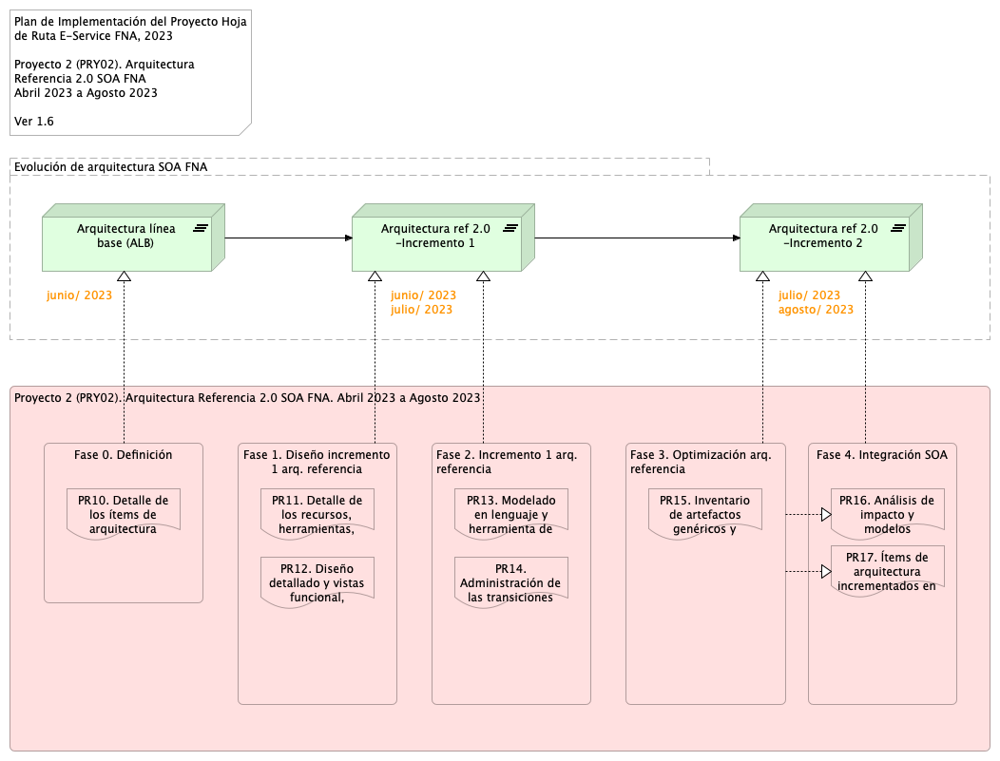

title: E-Service Etapa 2. Arquitectura de Referencia SOA 2.0 del FNA
geometry:
  - top=1in
  - bottom=1in
fignos-cleveref: True
fignos-plus-name: Fig.
fignos-caption-name: Imagen
tablenos-caption-name: Tabla
...

<small><em>Los productos de esta etapa ([Web](https://hwong23.github.io/fna-dd-f2-pry2-e2/v/a1e7bf5df9f20a1247bb5ad6f4ff0904503cbbd3/))
están basados en el resultado de la consultoría "Arquitectura E-Service",
[Sharepoint STEF@a1e7bf5](https://stefaninilatam.sharepoint.com/:f:/r/sites/PROYECTOARQUITECTURAE-SERVICEFNA/Documentos%20compartidos/General/Repositorio%20SOA/Procesos%20Fase%20II/181-2020.%20E-SERV.%20Fase%202-ETAPA%200.%20docx?csf=1&web=1&e=BiNcBP)
del August 4, 2023.
</em></small>

|    **Versión** del producto 1.a1e7bf5 de 04 Aug 2023

 

## Autores

+ **Harry Wong, ing.**
   
    · {.inline_icon width=16 height=16}
    [e_hwong](https://github.com/e_hwong)
     
  <small>
     Arquitecto SOA, Stefanini
  </small>

+ **Wilson Morales, ing.**
   
    · {.inline_icon width=16 height=16}
    [wmorales](https://github.com/wmorales)
     
  <small>
     Software, Aplicaciones
  </small>

+ **Sergio Andrés Castro Hernandez, ing.**
   
    · {.inline_icon width=16 height=16}
    [fhernandez](https://github.com/fhernandez)
     
  <small>
     SOA, Arquitectura
  </small>

+ **Viviana M. Martinez, ing.**
   
    · {.inline_icon width=16 height=16}
    [vmmartinez](https://github.com/vmmartinez)
     
  <small>
     Analista, Proyectos
  </small>

::: {#correspondence}
✉ — Enviar mensajes a Harry Wong, ing. \<e_hwong@stefanini.com\>.

:::

 

## Objetivo del Documento
Entrega de los productos de la Etapa 2, PR13. Modelado en lenguaje y herramienta de diseño del FNA​ y PR14. Administración de las transiciones hacia la arquitectura versión 2.0, del proyecto Arquitectura de Referencia SOA 2.0 del FNA, flujos de trabajo y personas que ejercitan y conforman (cumplen) con el gobierno SOA del FNA a desplegar a cargo de la oficina de arquitectura.

##  Control de Cambios {.page_break_before}
| Tema           | PRY02 Arquitectura de Referencia SOA 2.0 del FNA      |
|----------------|----------------------------|
| Palabras clave | SOA, E-Service, FNA, Análisis de brecha, GAP, Comparativa              |
| Autor          |                            |
| Fuente         |                            |
| Versión        | 1.a1e7bf5 del 04 Aug 2023 |
| Vínculos       | [N003a Vista Segmento SOA FNA](N03a%a20Vsta%20aSegenta%20SOA%20FNA.md) |

 

 

## Contenidos
\toc

\newpage

>    E-Service. Fase II
>
>    PRY02. Arquitectura de Referencia SOA 2.0 del FNA. Contenido de los Productos Contractuales
>
>    Contrato 1812020
>
>    FNA, Stefanini
>
>    04 Aug 2023
>
>    **Versión** 1.a1e7bf5

 

# Producto 13: PR13. Modelado en lenguaje y herramienta de diseño del FNA​
El principal entregable de este producto son los modelos de arquitectura de referencia 2.0 del FNA. Para la mayoría de los casos, y en este contexto, los modelos refieren a conjuntos información de ingeniería (no se agotan en solo diagramas o documentos) relevante a los sistemas de información, servicios, componentes y herramientas de software del FNA representados con el lenguaje de descripción de arquitectura designado, que para el caso es Archimate 3.0. Nota: distintos modelos de igual importancia que la arquitectura del FNA pueden estar representados en otros lenguajes de componentes, procesos de negocio, rendimiento, redes de comunicaciones.

Otro entregable primario de este producto es la documentación técnica inicial con la que denotamos a las especificaciones de línea base de la arquitectura de referencia 2.0 del FNA. Siendo que esta información textual puede ser considerada como discreta y de que no puede ser verificada (distinta de los modelos), sigue teniendo la ventaja de que es fácil de comunicar.

Juntos, los modelos y las especificaciones y requerimientos de arquitectura, estos entregables constituyen lo que llamamos la Arquitectura de Referencia SOA 2.0 del FNA, y que además de ser una línea base, tiene la responsabilidad adicional de ser la hoja de ruta y, por tanto, guía de la transformación de las arquitectura estado actual hacia esta nueva versión.

**Nota**: los análisis de este producto están dirigidos a cumplir los objetivos del proyecto PRY01, Gobierno SOA: desarrollo, gestión, gobierno de arquitectura y adopción.

 

## Justificación
La representación de la información de ingeniería relevante a los sistemas de información, servicios, componentes y herramientas de software del FNA en elementos de un modelo de arquitecturas supone algunas ventajas frente a la información textual, y de cualquier otro tipo, y de ahí el mérito de estos. Una de estas ventajas es que los modelos pueden acopiar y _asociarse (mapear) con requerimientos de arquitectura mediante unidades de trabajo accionables como épicas, casos de uso, historias y escenarios_. Además, los modelos comportan la ventaja de que son verificables y de fácil transporte. Pero ninguna de estas razones es lo más importante. La verdadera justificación de tener modelado de esta arquitectura de referencia 2.0 (en un lenguaje de descripción de arquitectura) es que el FNA cuente con la creación de un entorno centrado en modelos, el cual, deja abierta la posibilidad de la aplicación de técnicas y creación de productos de ingeniería.

## Contenidos
1. Análisis de los elementos del modelo de la arquitectura de referencia SOA 2.0 del FNA
1. Repositorio de arquitectura del FNA actualizado con arquitectura de referencia
1. Documentación técnica 0.2 de la arquitectura de referencia SOA
1. Proceso de mantenimiento de la arquitectura de referencia SOA 2.0 del FNA

 

## Criterios de Aceptación
* Repositorio de arquitectura del FNA actualizado con arquitectura de referencia
* Entendimiento del proceso de mantenimiento de la arquitectura de referencia SOA 2.0 del FNA y sus implicaciones

 

## Repositorio de Arquitectura del FNA, versión 0.1
{#fig: width=}

_Fuente: Diagnóstico SOA. E-Service (2022)._

## Modelo de Implementación del PRY02
{#fig: width=}

_Fuente: Elaboración propia._

 

---
prnombre: "Modelado en lenguaje y herramienta de diseño del FNA​"
...

\newpage

| Tema           | Modelado en lenguaje y herramienta de diseño del FNA​: **Análisis de los elementos del modelo de la arquitectura de referencia SOA 2.0 del FNA** |
|----------------|----------------------------------------------------------------------|
| Palabras clave | SOA, Arquitectura de referencia, Flujo de trabajo                    |
| Autor          |                                                              |
| Fuente         |                                                              |
| Versión        | **1.a1e7bf5** del 04 Aug 2023                       |
| Vínculos       | [Ejecución Plan de Trabajo SOA](onenote:#N001d.sharepoint.com); [Procesos de Negocio FNA](onenote:#N003a.com)|

 

# Análisis de Elementos Relevantes para la Arquitectura de Referencia SOA 2.0 del FNA
## Catálogo de Servicios FNA (blueprint)

### Capacidades de la Empresa FNA
No hay capacidades de negocio FNA en los modelos de la empresa, pero en la documentación del repositorio hay información sustituta con la que hacemos una propuesta de la vista de las capacidades FNA. Esta vista preliminar sirve para relacionar las capacidades preliminares con los servicios SOA de la empresa y con los demás elementos de la vista de segmento.

Capacidades de negocio encontradas:

1. Desarrollo de nuevos negocios
1. Gestión de Cliente
1. Administración de Recursos y Negocio
1. Entrega de Productos
1. Servicios de Cuentas
1. Gestión Financiera

_Fuente: Portafolio de Aplicaciones FNA._

 

### Importancia de las Capacidades y Servicios SOA (y otras partes de la empresa)
La intersección de la vista de segmento del FNA con las capacidades de negocio propuestas por este ejercicio (en color naranja abajo) resultará en la lista de servicios de negocio más importantes para la empresa dado su nivel de relación con estas capacidades.

{#fig: width=}

 

Por lo anterior, los servicios SOA del FNA más relevantes según los modelos son los indicados a continuación. De igual manera que para el Fondo, estas partes de la empresa son importantes para futuros diagnósticos y gobierno SOA.

|**Parte FNA**|**Parte Relacionada**|**Tipo**|
|-------------|---------------------|--------|
|Desarrollo de nuevos negocios|AS026-Gestión de Autenticación|**application-service**|
||AS034-ConsultarestadocuentaCartera|**application-service**|
||ASXX3-RegistrarRecaudoObligacion|**application-service**|
||COBIS|application-component|
||Servicios COBIS|application-collaboration|
|Entrega de Productos|AS026-Gestión de Autenticación|**application-service**|
||AS034-ConsultarestadocuentaCartera|**application-service**|
||ASXX3-RegistrarRecaudoObligacion|**application-service**|
||COBIS|application-component|
||Servicios COBIS|application-collaboration|
|Gestión de Cliente|AS026-Gestión de Autenticación|**application-service**|
||AS034-ConsultarestadocuentaCartera|**application-service**|
||ASXX3-RegistrarRecaudoObligacion|**application-service**|
||COBIS|application-component|
||Servicios COBIS|application-collaboration|
|Servicios de Cuentas|AS026-Gestión de Autenticación|**application-service**|
||AS034-ConsultarestadocuentaCartera|**application-service**|
||ASXX3-RegistrarRecaudoObligacion|**application-service**|
||COBIS|application-component|

Table: servicios SOA del FNA más relevantes según modelos FNA. {#tbl:capacidades-id}

_Fuente: arquitectura fna.archimate_

 

Las capacidades de mayor importancia para el FNA debido a su nivel superior de relación con las partes relevantes de la empresa son los siguientes

|Nombre Origen|**Destino**|**Relevancia**|
|-------------|-----------|--------------|
|Desarrollo de nuevos negocios|COBIS|**96**|
|Desarrollo de nuevos negocios|AS026-Gestión de Autenticación|8|
|Desarrollo de nuevos negocios|AS034-ConsultarestadocuentaCartera|6|
|Desarrollo de nuevos negocios|ASXX3-RegistrarRecaudoObligacion|5|
|Desarrollo de nuevos negocios|Servicios COBIS|13|
|**Total Desarrollo de nuevos negocios**||128|
|Entrega de Productos|COBIS|**96**|
|Entrega de Productos|AS026-Gestión de Autenticación|8|
|Entrega de Productos|AS034-ConsultarestadocuentaCartera|6|
|Entrega de Productos|ASXX3-RegistrarRecaudoObligacion|5|
|Entrega de Productos|Servicios COBIS|13|
|**Total Entrega de Productos**||128|
|Gestión de Cliente|COBIS|**96**|
|Gestión de Cliente|AS026-Gestión de Autenticación|8|
|Gestión de Cliente|AS034-ConsultarestadocuentaCartera|6|
|Gestión de Cliente|ASXX3-RegistrarRecaudoObligacion|5|
|Gestión de Cliente|Servicios COBIS|13|
|**Total Gestión de Cliente**||128|
|Servicios de Cuentas|COBIS|**96**|
|Servicios de Cuentas|AS026-Gestión de Autenticación|8|
|Servicios de Cuentas|AS034-ConsultarestadocuentaCartera|6|
|Servicios de Cuentas|ASXX3-RegistrarRecaudoObligacion|5|
|**Total Servicios de Cuentas**||115|

Table: Las capacidades de mayor importancia para el FNA. {#tbl:capacidades2-id}

_Fuente: arquitectura fna.archimate_

 

---
prnombre: "Modelado en lenguaje y herramienta de diseño del FNA​"
...

\newpage

| Tema           | Modelado en lenguaje y herramienta de diseño del FNA​: **Análisis de los elementos del modelo de la arquitectura de referencia SOA 2.0 del FNA** |
|----------------|----------------------------------------------------------------------|
| Palabras clave | SOA, Arquitectura de referencia, Flujo de trabajo                    |
| Autor          |                                                              |
| Fuente         |                                                              |
| Versión        | **1.a1e7bf5** del 04 Aug 2023                       |
| Vínculos       | [Ejecución Plan de Trabajo SOA](onenote:#N001d.sharepoint.com); [Procesos de Negocio FNA](onenote:#N003a.com)|

 

# Análisis de Elementos Relevantes para la Arquitectura de Referencia SOA 2.0 del FNA
## Catálogo de Servicios FNA (blueprint)

### Capacidades de la Empresa FNA
No hay capacidades de negocio FNA en los modelos de la empresa, pero en la documentación del repositorio hay información sustituta con la que hacemos una propuesta de la vista de las capacidades FNA. Esta vista preliminar sirve para relacionar las capacidades preliminares con los servicios SOA de la empresa y con los demás elementos de la vista de segmento.

Capacidades de negocio encontradas:

1. Desarrollo de nuevos negocios
1. Gestión de Cliente
1. Administración de Recursos y Negocio
1. Entrega de Productos
1. Servicios de Cuentas
1. Gestión Financiera

_Fuente: Portafolio de Aplicaciones FNA._

 

### Importancia de las Capacidades y Servicios SOA (y otras partes de la empresa)
La intersección de la vista de segmento del FNA con las capacidades de negocio propuestas por este ejercicio (en color naranja abajo) resultará en la lista de servicios de negocio más importantes para la empresa dado su nivel de relación con estas capacidades.

{#fig: width=}

 

Por lo anterior, los servicios SOA del FNA más relevantes según los modelos son los indicados a continuación. De igual manera que para el Fondo, estas partes de la empresa son importantes para futuros diagnósticos y gobierno SOA.

|**Parte FNA**|**Parte Relacionada**|**Tipo**|
|-------------|---------------------|--------|
|Desarrollo de nuevos negocios|AS026-Gestión de Autenticación|**application-service**|
||AS034-ConsultarestadocuentaCartera|**application-service**|
||ASXX3-RegistrarRecaudoObligacion|**application-service**|
||COBIS|application-component|
||Servicios COBIS|application-collaboration|
|Entrega de Productos|AS026-Gestión de Autenticación|**application-service**|
||AS034-ConsultarestadocuentaCartera|**application-service**|
||ASXX3-RegistrarRecaudoObligacion|**application-service**|
||COBIS|application-component|
||Servicios COBIS|application-collaboration|
|Gestión de Cliente|AS026-Gestión de Autenticación|**application-service**|
||AS034-ConsultarestadocuentaCartera|**application-service**|
||ASXX3-RegistrarRecaudoObligacion|**application-service**|
||COBIS|application-component|
||Servicios COBIS|application-collaboration|
|Servicios de Cuentas|AS026-Gestión de Autenticación|**application-service**|
||AS034-ConsultarestadocuentaCartera|**application-service**|
||ASXX3-RegistrarRecaudoObligacion|**application-service**|
||COBIS|application-component|

_Fuente: arquitectura fna.archimate_

 

Las capacidades de mayor importancia para el FNA debido a su nivel superior de relación con las partes relevantes de la empresa son los siguientes

|Nombre Origen|**Destino**|**Relevancia**|
|-------------|-----------|--------------|
|Desarrollo de nuevos negocios|COBIS|**96**|
|Desarrollo de nuevos negocios|AS026-Gestión de Autenticación|8|
|Desarrollo de nuevos negocios|AS034-ConsultarestadocuentaCartera|6|
|Desarrollo de nuevos negocios|ASXX3-RegistrarRecaudoObligacion|5|
|Desarrollo de nuevos negocios|Servicios COBIS|13|
|**Total Desarrollo de nuevos negocios**||128|
|Entrega de Productos|COBIS|**96**|
|Entrega de Productos|AS026-Gestión de Autenticación|8|
|Entrega de Productos|AS034-ConsultarestadocuentaCartera|6|
|Entrega de Productos|ASXX3-RegistrarRecaudoObligacion|5|
|Entrega de Productos|Servicios COBIS|13|
|**Total Entrega de Productos**||128|
|Gestión de Cliente|COBIS|**96**|
|Gestión de Cliente|AS026-Gestión de Autenticación|8|
|Gestión de Cliente|AS034-ConsultarestadocuentaCartera|6|
|Gestión de Cliente|ASXX3-RegistrarRecaudoObligacion|5|
|Gestión de Cliente|Servicios COBIS|13|
|**Total Gestión de Cliente**||128|
|Servicios de Cuentas|COBIS|**96**|
|Servicios de Cuentas|AS026-Gestión de Autenticación|8|
|Servicios de Cuentas|AS034-ConsultarestadocuentaCartera|6|
|Servicios de Cuentas|ASXX3-RegistrarRecaudoObligacion|5|
|**Total Servicios de Cuentas**||115|

_Fuente: arquitectura fna.archimate_

 

---
pr14nombre: "Administración de las transiciones hacia la arquitectura versión 2.0"
...

\newpage

>    E-Service. Fase II
>
>    PRY02. Arquitectura de Referencia SOA 2.0 del FNA. Contenido de los Productos Contractuales
>
>    Contrato 1812020
>
>    FNA, Stefanini
>
>    04 Aug 2023
>
>    **Versión** 1.a1e7bf5

 

# Producto 14: PR14. Administración de las transiciones hacia la arquitectura versión 2.0
Las arquitecturas de referencia, en el contexto del ejercicio de este proyecto, tienen el rol de servir de mapa de viaje contra el cual comparar el recurrido de un cambio objetivo. El arribo a otro estadio de las cosas es lo que llamamos formalmente como Plateu, en Archimate 3.0, para denotar un estado estable de del funcionamiento de los componentes de una arquitectura transaccionada por efecto de las operaciones de trabajo que se han realizado sobre esta. Esta arquitectura afectada por el trabajo, que es distinta de las actualizaciones de los modelos (porque la supera en proporción e intención), y que ha llegado a un estado estable es lo que llamamos en este proyecto transición. Por ende, las arquitecturas intermedias que se den, o las transiciones, las denominamos arquitecturas de transición.

Sobre estas transacciones trataremos en este producto, PR14, Administración de las transiciones hacia la arquitectura versión 2.0. Consideraremos el contexto del Fondo Nacional, diagnósticos inclusive, para establecer una forma (métodos) en la que estos cambios deban ser realizados, las transiciones de las arquitecturas gestionadas y vigiladas, todo esto para finalmente llegar a tratar del cómo lograr la adopción dentro de estas transformaciones entre los actores e involucrados del FNA.

**Nota**: los análisis de este producto están dirigidos a cumplir los objetivos del proyecto PRY01, Gobierno SOA: desarrollo, gestión, gobierno de arquitectura y adopción.

 

## Justificación
Las arquitecturas de transición son el sujeto principal, causa, de la movilidad de un estado de las cosas a otro intencionadamente superior debido a las afectaciones a las capacidades que implican. La transición juega en paralelo con el concepto de uso y adopción del cambio de arquitectura, al que agregamos nosotros el valor del aprovechamiento de este movimiento de un estadio a otro. De ahí que, además de crear transiciones con los métodos propuestos, la gestión de estos entregables sobresale porque estas le apuntan a que los retornos se den según expectativas del cambio mientras mantiene el control de los riesgos (probabilidad de éxito) y administra los obstáculos. Gestionar transiciones de las arquitecturas en el FNA es en últimas garantizar que la arquitectura proveerá el resultado que persiguen los cambios sin comprometer su estabilidad (funcionamiento).

## Contenidos
1. Posibles estadios de adopción y madurez de las arquitecturas para el FNA
1. Relación de las transiciones con las capacidades de negocio y tecnología del FNA
1. Relación de las transiciones con la efectividad (madurez) de los servicios SOA del FNA
1. Métodos del FNA para la creación y gestión de arquitecturas de transición
1. Criterios y métodos de evaluación de arquitecturas de transición

 

## Criterios de Aceptación
* Entendimiento de los métodos, tanto de creación de transiciones, como de hoja de rutas para su aplicación en el FNA
* Entendimiento del relacionamiento de las capacidades del FNA y los índices de madurez SOA con las arquitecturas de transición
* Entendimiento del método para gestionar las arquitecturas de transición del FNA
* Entendimiento del rol de la Oficina de Arquitectura en la gestión de las arquitecturas de transición del FNA

 

## Modelo de Implementación del PRY02
{#fig: width=}

_Fuente: Elaboración propia._

 

\newpage

# Referencias {.page_break_before}
<!-- Explicitly insert bibliography here -->

@eservices1-22 @eservices3-22 @eservices4-22 @eservices5-23 @eservices6-12 @eservices7-23 @bptrends07

